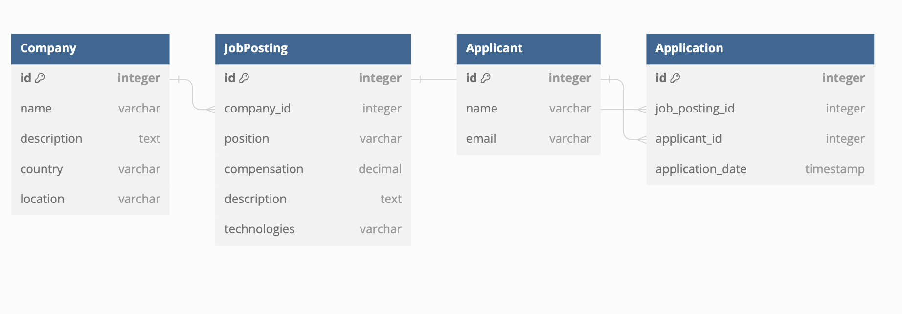

# wanted-pre-onboarding-backend
## 요구사항 분석
* 채용공고 등록
* 채용공고 수정
  * 회사 id 이외 모두 수정 가능
* 채용공고 삭제
* 채용공고 목록 가져오기
  * 회사명, 국가, 지역까지 보여질 수 있도록 company모델 데이터 추출
  * 채용공고 검색 기능 구현
  * 채용공고 id는 검색하지 않을 것으로 판단, 해당 필드 검색 필드에서 제외
* 채용 상세페이지 가져오기
  * 채용내용을 추가로 응답받음
  * 해당 회사가 올린 다른 채용공고(상세페이지 채용공고 제외)를 리스트로 응답
* 사용자는 채용공고에 지원
  * 사용자는 채용공고에 아래 형태로 지원
  ```
    Example)
    {
    "채용공고_id": 채용공고_id,
    "사용자_id": 사용자_id
    }
    ```
    * 사용자는 1회만 지원 가능
      * 특정 같은 채용공고에 대해 중복지원 불가라는 말이 없었으므로, 전체 채용공고 대상으로 시스템 전체에서 단 한번의 지원만 가능하도록 조건문 추가

## 설치 방법
```
git clone https://github.com/leejongeun2/wanted-pre-onboarding-backend.git
cd wanted-pre-onboarding-backend
pip install -r requirements.txt
python manage.py migrate

```
서버 실행
```
python manage.py runserver
```
### 관리자 계정 생성방법
```
python manage.py createsuperuser
```
```
Username: admin
Email address: admin@example.com
Password: ********
Password (again): ********
Superuser created successfully.
```
```
python manage.py runserver
```
## 사용 방법
* [postman API 엔드포인트 문서](https://documenter.getpostman.com/view/30448329/2s9YR57uzF)

| Endpoint | HTTP Method | Success Response | Failure Response | Notes |
|----------|-------------|------------------|------------------|-------|
| `application/apply-to-job/` | POST | Code: 201 Content: `{"message": "지원이 성공적으로 제출되었습니다."}` | Code: 400 Content: `{"error": "이미 채용공고에 지원하셨습니다. 사용자는 한 번만 지원 가능합니다."}` Code: 404 Content: `{"error": "채용 공고를 찾을 수 없습니다."}` Code: 500 Content: `{"error": "<error message>"}` | 사용자는 한 채용공고에 한 번만 지원할 수 있습니다. |
| `/job_posting/create/` | POST | Code: 200 Content: `"Job posting created successfully."` | Code: 400 Content: `{"<field>": ["<error message>"]}` Code: 400 Content: `"Error: Submitted data is not in JSON format"` | 채용공고를 생성하기 위한 엔드포인트입니다.  |
| `/job_posting/1/update/` | POST | Code: 200 Content: `"Job posting updated successfully."` | Code: 400 Content: `{"<field>": ["<error message>"]}` | 채용공고를 업데이트하기 위한 엔드포인트입니다. `<posting_id>`는 업데이트하려는 채용공고의 ID입니다. |
| `/job_posting/2/delete` | DELETE | Code: 200 Content: `{"message": "Job posting deleted successfully"}` | Code: 404 Content: `{"error": "Job posting not found"}` | `<posting_id>`는 삭제하려는 채용공고의 ID입니다. 이 엔드포인트는 채용공고를 삭제합니다. |
| `/job_posting/list_job_postings/` | GET | Code: 200 Content: `[{"채용공고_id": "<id>", "회사명": "<name>", "국가": "<country>", "지역": "<location>", "채용포지션": "<position>", "채용보상금": "<compensation>", "사용기술": "<technologies>", ...}, ...]` | - | 이 엔드포인트는 모든 채용공고의 목록을 반환합니다. `select_related`를 사용하여 연관된 회사 정보도 함께 제공됩니다. |
| `/job_posting/1/` | GET | Code: 200 Content: `{"채용공고_id": "<id>", "회사명": "<name>", "국가": "<country>", "지역": "<location>", "채용포지션": "<position>", "채용보상금": "<compensation>", "사용기술": "<technologies>", "채용내용": "<description>", "회사가올린다른채용공고": ["<id1>", "<id2>", ...]}` | Code: 404 Content: `"Job posting does not exist"` | `<posting_id>`는 상세 정보를 조회하려는 채용공고의 ID입니다. 이 엔드포인트는 특정 채용공고의 상세 정보를 제공합니다. |
| `/job_posting/some/url?search=JAVA` | GET | Code: 200 Content: `[{"채용공고_id": "<id>", "회사명": "<name>", "국가": "<country>", "지역": "<location>", "채용포지션": "<position>", "채용보상금": "<compensation>", "사용기술": "<technologies>", ...}, ...]` | - | 사용자는 'search' 쿼리 매개변수를 사용하여 채용공고를 검색할 수 있습니다. 검색은 여러 필드에서 대소문자를 구분하지 않고 수행됩니다. |
 * ERD
 
## 구현 과정
1. 앱 4개로 분리 이유:

> 확장성: 기능 확장을 위해 company와 users 앱을 초기에 분리하였습니다. 이는 추후 각 앱의 기능 추가 및 확장 시 유연성을 제공합니다.

> 코드 관리 및 명확성: 앱을 별도로 분리함으로써 코드의 구조화가 개선되고, 팀원들이 프로젝트 구조를 이해하고 유지보수하기 쉬워집니다.
2. 함수 기반 뷰(FBV) 선택:

> 본 프로젝트의 간단한 뷰 로직에는 FBV가 적합하다고 판단되어 선택하였습니다.

3. 별도의 applicant 모델 생성:

> 사용자 인증 기능이 없기 때문에, 일반 user와 구별하기 위해 장고 모델인 user 모델과 1:1 연결을 하지 않고 applicant 모델을 별도로 생성하였습니다.
4. 요청/응답 데이터 JSON 사용:

> JSON은 데이터 교환의 표준으로, 다양한 클라이언트 애플리케이션과의 호환성 및 복잡한 데이터 구조 표현에 이점이 있습니다.
```
@csrf_exempt
def create_job_posting(request):
    # ... [중략] ...
```

5. 채용공고 수정 시 별도 모델 폼 사용:
> 코드의 깔끔함 및 유지보수를 위해 채용공고 수정 기능에 모델 폼을 적용하였습니다.
```
# 수정용 폼
class JobPostingUpdateForm(forms.ModelForm):
    # ... [중략] ...
```


